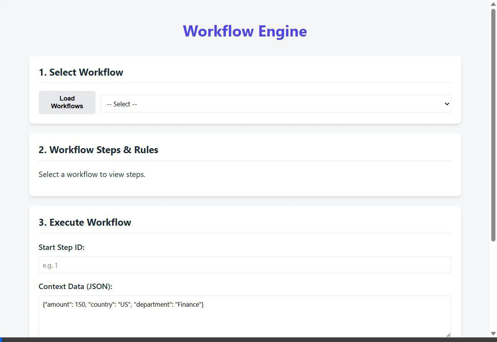
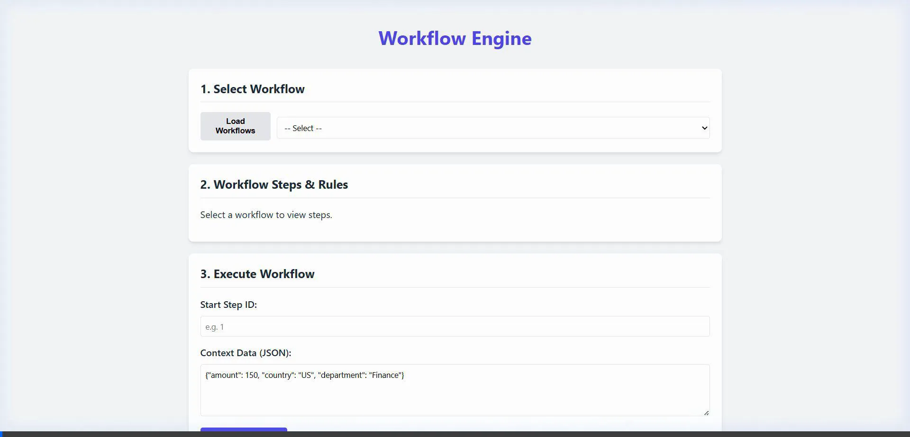
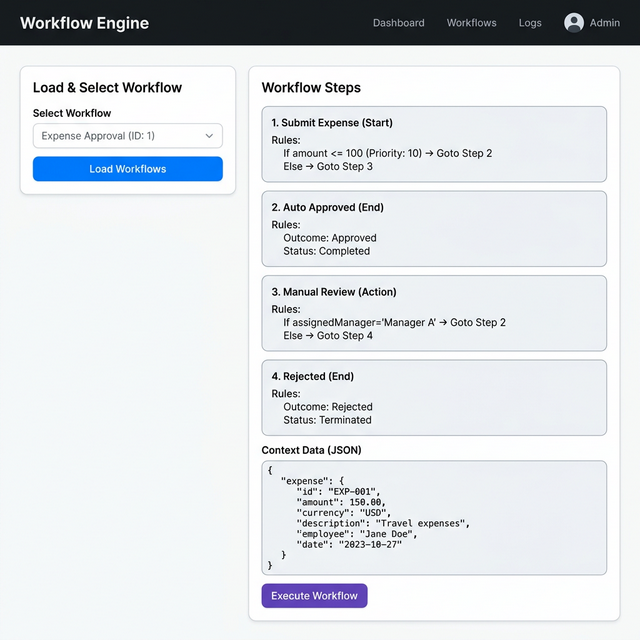
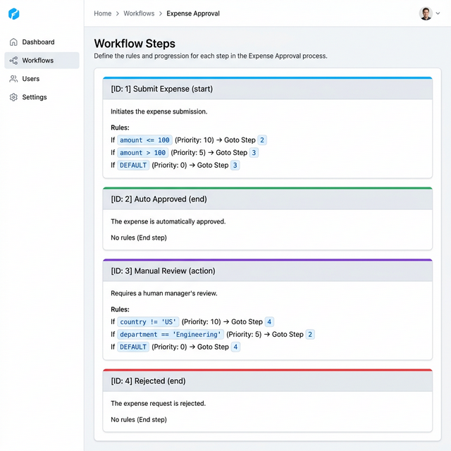
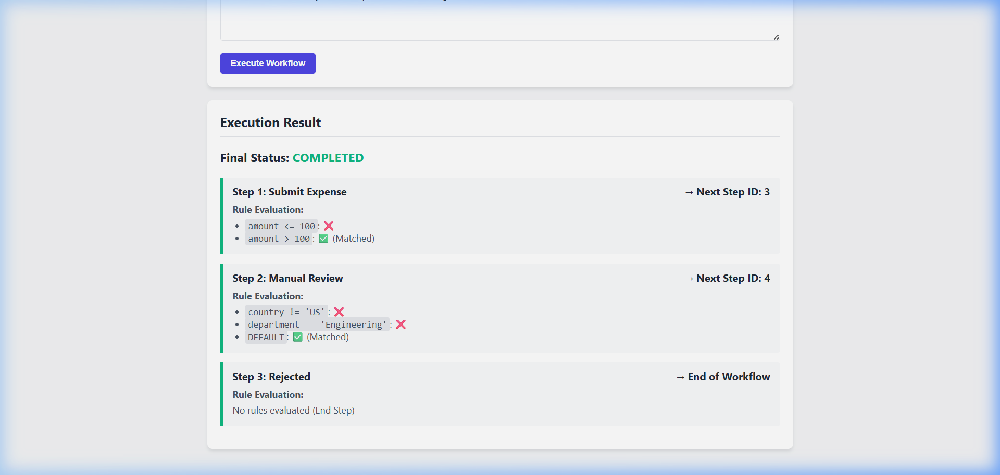

# 🔄 Workflow Engine

A full-stack **Workflow Automation System** built with **FastAPI** (Python) and **HTML/CSS/JavaScript**. Create workflows with steps and rule-based transitions, execute them dynamically, and visualize results with full logging.

---

## 🎬 Demo

### Scenario 1 — Small Expense: Auto-Approved
> `amount: 50, country: US, department: Engineering`



---

### Scenario 2 — Large Expense: Manual Review → Rejected
> `amount: 250, country: US, department: Marketing`



---

## 🖼️ Screenshots

### Dashboard — Load & Select Workflow


### Workflow Steps & Rules


### Execution Result — Live Rule Evaluation


---


## ✨ Features

- 📋 **Workflow Builder** — Create workflows with multiple steps
- 🔀 **Rule Engine** — Priority-based conditional routing between steps
- ⚡ **Execution Engine** — Step-by-step automated workflow execution
- 📊 **Live Logs** — Real-time rule evaluation results per step
- 🛡️ **Loop Prevention** — Max-steps guard to prevent infinite loops
- 📦 **Zero External DB** — Uses native SQLite (no ORM required)

---

## 🗂️ Project Structure

```
workflow_automation/
├── backend/
│   ├── __init__.py
│   ├── database.py     # SQLite setup and table initialization
│   ├── main.py         # FastAPI routes (CRUD + execute)
│   ├── execution.py    # Workflow execution engine
│   ├── engine.py       # Rule condition evaluator (AST-based)
│   └── schemas.py      # Pydantic request/response models
├── frontend/
│   ├── index.html      # Dashboard UI
│   ├── style.css       # Styling
│   └── app.js          # API calls + execution log renderer
├── seed.py             # Seeds the Expense Approval sample workflow
├── .gitignore
└── README.md
```

---

## 🚀 Getting Started

### Prerequisites
- Python 3.8+
- pip packages: `fastapi`, `uvicorn`, `pydantic`, `requests`

```bash
pip install fastapi uvicorn pydantic requests
```

### 1. Start the Backend

```bash
cd workflow_automation
py -m uvicorn backend.main:app --host 0.0.0.0 --port 8001
```

API live at: `http://127.0.0.1:8001`  
Swagger docs: `http://127.0.0.1:8001/docs`

### 2. Seed Sample Workflow

```bash
py seed.py
```

Creates the **Expense Approval** workflow with all steps and rules.

### 3. Start the Frontend

```bash
cd frontend
py -m http.server 8080
```

Open in browser: **`http://127.0.0.1:8080`**

---

## 🧾 Sample Workflow — Expense Approval

```
Submit Expense
  ├── amount <= 100  (priority 10) ──→ Auto Approved ✅
  ├── amount > 100   (priority 5)  ──→ Manual Review
  └── DEFAULT        (priority 0)  ──→ Manual Review

Manual Review
  ├── country != 'US'             (priority 10) ──→ Rejected ❌
  ├── department == 'Engineering' (priority 5)  ──→ Auto Approved ✅
  └── DEFAULT                     (priority 0)  ──→ Rejected ❌
```

### Scenario 1 — Auto Approved
```json
{ "amount": 50, "country": "US", "department": "Engineering" }
```
> Submit Expense → **Auto Approved** ✅

### Scenario 2 — Rejected via Manual Review
```json
{ "amount": 250, "country": "US", "department": "Marketing" }
```
> Submit Expense → Manual Review → **Rejected** ❌

---

## 🔌 API Endpoints

| Method | Endpoint | Description |
|---|---|---|
| `POST` | `/api/workflows` | Create a workflow |
| `GET`  | `/api/workflows` | List all workflows |
| `POST` | `/api/workflows/{id}/steps` | Add a step |
| `GET`  | `/api/workflows/{id}/steps` | Get steps with rules |
| `POST` | `/api/steps/{id}/rules` | Add a rule to a step |
| `POST` | `/api/workflows/{id}/execute` | Execute a workflow |
| `GET`  | `/api/executions/{id}` | Get execution + logs |

### Execute Request Body
```json
{
  "start_step_id": 1,
  "data": { "amount": 50, "country": "US", "department": "Engineering" }
}
```

---

## 🧠 How the Rule Engine Works

Rules use simple Python expression syntax evaluated safely via Python's `ast` module:

| Condition | Operators |
|---|---|
| `amount > 100` | `>`, `<`, `>=`, `<=`, `==`, `!=` |
| `country == 'US'` | String comparison |
| `amount > 100 and country == 'US'` | `and`, `or`, `not` |
| `DEFAULT` | Always matches (fallback) |

Rules are evaluated in **priority order** (highest first). The first matching rule determines the next step.

---

## 📄 License

MIT License — free to use, modify, and distribute.
